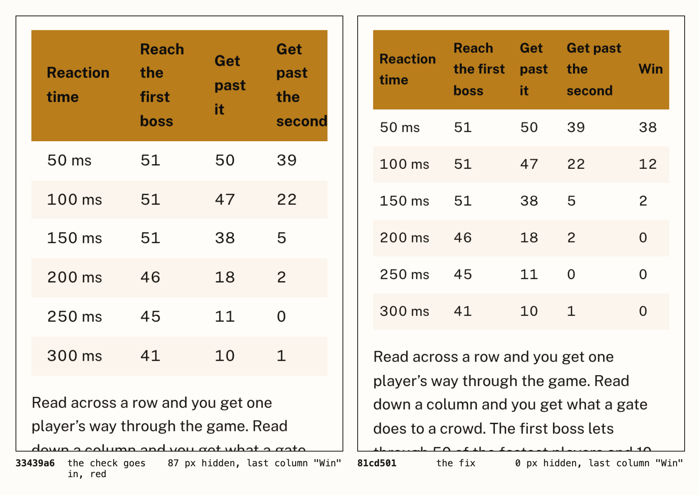

# Process overview

## What I built

SLOP2875 *Is It Me or Is It the Game?* spends twelve weeks measuring one game,
Close Quarters, which I made in crit 5
([`96bd028`](https://github.com/comp4020-agentic-coding-studio/comp4020-ass2-Anson0028/commit/96bd028)).
I stayed in my Assignment 1 subject on purpose. Its Response scored 65 and the
marker's note was to nail down the one thing I was explaining before building.
That note is this course's first rule
([`26e56e9`](https://github.com/comp4020-agentic-coding-studio/comp4020-ass2-Anson0028/commit/26e56e9)).

## What I decided a good course is

One specimen all semester, one claim a week, every tutorial ending in a number
the student measured, each assessment built on the one before ([`44a26c6`](https://github.com/comp4020-agentic-coding-studio/comp4020-ass2-Anson0028/commit/44a26c6),
[`48fe7f2`](https://github.com/comp4020-agentic-coding-studio/comp4020-ass2-Anson0028/commit/48fe7f2)). A survey of game balance is the obvious course, and a real
committee would pass it, which is the brief's test for too broad.

Claude's first reading list gave every week a paper, and I cut it — "one a week
feels like too much, make it one every two or three weeks" — to five for the
semester, against Calling Bullshit's one to three
([`26e56e9`](https://github.com/comp4020-agentic-coding-studio/comp4020-ass2-Anson0028/commit/26e56e9)).
The course was called Measuring Game Balance Without Players until I put two
objections to it: a real university could offer it, which is the brief's test
for too broad, and nobody would want to click it
([`f888122`](https://github.com/comp4020-agentic-coding-studio/comp4020-ass2-Anson0028/commit/f888122)).
Reading the strongest classmates' sites against the rubric found the same fault
a level down. Read down *Try Again, Later* and the week list is an argument;
mine read Gates, Dead options, Simulated players. Every title became that week's
own claim in plain words
([`3a06dd6`](https://github.com/comp4020-agentic-coding-studio/comp4020-ass2-Anson0028/commit/3a06dd6)).
The lab book went because I could not explain it in one line, and twelve
five-minute quizzes took its place, each asking for the number just measured
([`51f6a06`](https://github.com/comp4020-agentic-coding-studio/comp4020-ass2-Anson0028/commit/51f6a06)).

## What went into the harness, and what stayed out

Six checks on the shape of the semester came before any week existed. Five were
red; the sixth passed only because the starter's placeholders summed to 100
([`01baaab`](https://github.com/comp4020-agentic-coding-studio/comp4020-ass2-Anson0028/commit/01baaab)).
Most of what followed also went in red, with the failure named: every slide at
phone size, where seven table slides were at 8.8 px
([`a6deb65`](https://github.com/comp4020-agentic-coding-studio/comp4020-ass2-Anson0028/commit/a6deb65)), and the code lines that check had never measured
([`4da87b4`](https://github.com/comp4020-agentic-coding-studio/comp4020-ass2-Anson0028/commit/4da87b4)).

Voice, whether a reading is real, and whether a stranger can tell what a thing
is are held by hand in `CLAUDE.md` ([`add7bf5`](https://github.com/comp4020-agentic-coding-studio/comp4020-ass2-Anson0028/commit/add7bf5)): no test can tell whether a
paragraph sounds like a person.

The harness went wrong first. The new `CLAUDE.md` carried nothing from earlier
weeks and no check noticed until I asked ([`1c27ee7`](https://github.com/comp4020-agentic-coding-studio/comp4020-ass2-Anson0028/commit/1c27ee7)). I blamed the model
switch. The cause was that I had the agent clone the repo by hand, skipping the
course skill's step that carries the harness over ([`c56ea2c`](https://github.com/comp4020-agentic-coding-studio/comp4020-ass2-Anson0028/commit/c56ea2c)). The fix
is still one line in `CLAUDE.md` that nothing enforces.

When the agent's sweeps stopped finding anything ([`d69d230`](https://github.com/comp4020-agentic-coding-studio/comp4020-ass2-Anson0028/commit/d69d230)), I split
the review into agents that each read the site one way — a first-time visitor, a
student deciding whether to enrol, a marker with the brief, the rubric and
Ushini's feedback on my A1 — and opened a session with no context to judge it
from zero. What a check could hold became a check that failed first, then a fix
([`e555e59`](https://github.com/comp4020-agentic-coding-studio/comp4020-ass2-Anson0028/commit/e555e59), [`4b0545d`](https://github.com/comp4020-agentic-coding-studio/comp4020-ass2-Anson0028/commit/4b0545d)); the rest became page fixes ([`83b8fd6`](https://github.com/comp4020-agentic-coding-studio/comp4020-ass2-Anson0028/commit/83b8fd6)).
Three rounds ([`4da87b4`](https://github.com/comp4020-agentic-coding-studio/comp4020-ass2-Anson0028/commit/4da87b4)). One found week 11 hiding its last column on a
phone: the check went in red, the fix after ([`33439a6`](https://github.com/comp4020-agentic-coding-studio/comp4020-ass2-Anson0028/commit/33439a6), [`81cd501`](https://github.com/comp4020-agentic-coding-studio/comp4020-ass2-Anson0028/commit/81cd501)), and
`pnpm evidence:shot` retakes this picture from both commits.

What no check could hold stayed a reading job. Week 10's lecture said to play
the game on the Tuesday before the tutorial that needs you not to have
([`3fc970b`](https://github.com/comp4020-agentic-coding-studio/comp4020-ass2-Anson0028/commit/3fc970b)); tutorial 7 quoted a ceiling of 20 damage a second beside a
measured 561 hp gate above it ([`a470c7a`](https://github.com/comp4020-agentic-coding-studio/comp4020-ass2-Anson0028/commit/a470c7a)). Neither failed anything.

## How I knew before I accepted it

The spec recomputes the printed numbers with the runner the page's button uses.
It could not go in red, because the pages already agreed with it, so I watched it
fail twice on purpose: bolt damage 17 to 18, and a median edited 78.0 to 78.1
([`1fd2fe2`](https://github.com/comp4020-agentic-coding-studio/comp4020-ass2-Anson0028/commit/1fd2fe2)).
Then CI went red on Linux ([run](https://github.com/comp4020-agentic-coding-studio/comp4020-ass2-Anson0028/actions/runs/35433193329)):
seed 97 ended at 63.1 s, not 69.333 s. I narrowed the claim to one kind of
machine and made week 2 teach the difference ([`5dbff8c`](https://github.com/comp4020-agentic-coding-studio/comp4020-ass2-Anson0028/commit/5dbff8c)).

## Thin spots

The twelve weeks of lectures went in within twenty minutes
([`c78cdd8`](https://github.com/comp4020-agentic-coding-studio/comp4020-ass2-Anson0028/commit/c78cdd8), [`e6ab4b4`](https://github.com/comp4020-agentic-coding-studio/comp4020-ass2-Anson0028/commit/e6ab4b4)),
and three of the six checks in [`7d54673`](https://github.com/comp4020-agentic-coding-studio/comp4020-ass2-Anson0028/commit/7d54673) passed on their first run.
Most of the prose is the agent's; the decisions are mine
([`d151aee`](https://github.com/comp4020-agentic-coding-studio/comp4020-ass2-Anson0028/commit/d151aee)).
